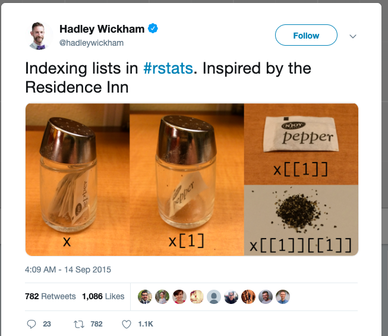
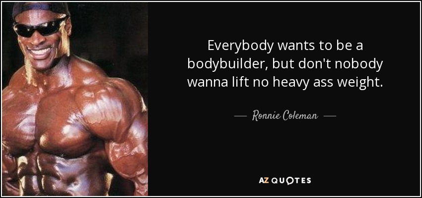

```{r setup, include = FALSE, echo = FALSE}
library(knitr)
knitr::opts_chunk$set(echo = FALSE)
```

# Notes on the Thursday's lecture

* Changing the levels of a factor
* converting factors to numeric
* data classes: lists and matrices

# Lists



# Notes on Thursday's lecture (cont.)

* generating random numbers and matrix
* Up arrow in RStudio
* RMarkdown basics

# Recap

* Import and Export data
    * Know your paths!
    * Most export functions include keyword "write" (i.e., `write.table`)
* Classes (bicycle analogy)
    * can have particular operations
    * some functions are similar across classes
    * identify a class by using the `class` function
* Factors and levels
* `data.frames` and `lists`
* subsetting using vectors
    * Accessing columns with `[` and `$`
* coercion (`as.`**classname**)

# Motivation



# Motivation (cont.)

* Learning R requires constant practice
* Persistence
* Enjoy it!

# Expectations


# Expectations (cont.)

* Exposure to the R language
* Basics of troubleshooting and debugging
* Learning R won't happen overnight

# Data Manipulation Overview

* Subsetting (cont.)
    * vectors and `[` with character, numeric, logical
    * `lists` and `[` / `$`
    * double brackets `[[`
    * with conditions
* Sorting and aggregating data
* removing duplicated records
* removing records with `NA`
* merging and binding
* transformations

# Subsetting

* can be done with either the `[` bracket or tidyverse operations
* Think about dimensions before doing the subset
* Think in terms of verbs (slice, select)
* Draw it out!
* `$` extracts a vector from a `data.frame`
* `[[` extracts and reduces to a single vector where possible from a
`data.frame` or `list`
* conditions help us specify what section of the data we want
    * `sex == "males"`
    * `age >= 18`

# Sorting and aggregating data

* `order` function - returns an index of ordered positions
* tidyverse: `arrange` - returns the arranged data

# Formula notation in R

* Uses the `~` for denoting a formula
    * `y ~ m*x + b`
* Good for specifying linear models
* Mainly used in base R code
* Useful for creating crosstabs!
    * `xtabs(A ~ B, data = blue)`
* Look out for `formula` class inputs
    * see `?xtabs`
    * see `?t.test`
* Usually requires a `data` input / argument for the function

# Useful conditions for subsetting

* Removing duplicated rows
    * `duplicated` on a `data.frame`
* Removing records with `NA`
    * `is.na` to get a logical vector

# Merging and Binding

* `merge` function
    * takes two `data.frame`s as input
    * arguments tell it how to merge
    * see example
* `cbind` and `rbind`
    * concatenate by columns or rows
    * `rbind`: names in columns must match
    * `cbind`: number of rows must match
* Tidyverse
    * `join` construct
    * see RStudio cheatsheet

# Transformations / Manipulations

* long to wide format
* `dplyr` and `reshape2` packages
* `aggregate` / `group_by`

# Discussion

* Working with data
    * Tools at your disposal
    * String together powerful functions
    * Organization is key
* Recognize how data should be represented
    * long vs wide
* Recognize what data format is best for visualization
