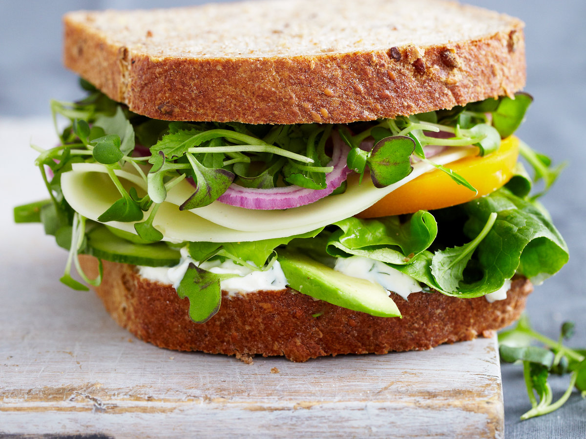

```{r setup, include = FALSE, echo = FALSE}
library(knitr)
knitr::opts_chunk$set(echo = FALSE)
```

# Announcements

* Downloading files from GitHub
    * Use the 'raw' button when at the page
    * Use Git GUI software
        * https://git-scm.com/download/gui/windows
    * Use functions that work with URLs (`read.csv`)
* Additional topics to cover
    * Formulas
    * Aggregating
    * Reshaping your data

# Formula notation in R

* Uses the `~` for denoting a formula
    * `y ~ m*x + b`
    * on the left, the outcome (`y`)
    * on the right, the variables (`x`s)
* Good for specifying linear models
* Mainly used in base R code
* Useful for creating crosstabs!
    * `xtabs(~ A + B, data = blue)`
* Look out for `formula` class inputs
    * see `?xtabs`
    * see `?t.test`
    * see `?lm`
* Usually requires a `data` input / argument in a supported function

# Sorting and aggregating data

* `order` function - which rows are lowest to highest?
* tidyverse: `arrange` - returns the arranged data
* `aggregate` - summarize data by a categorical variable
    * `aggregate(mtcars$mpg, by = list(mtcars$cyl), FUN = "mean")`
* `tapply`
    * `tapply(mtcars$mpg, mtcars$cyl, mean)`
* tidyverse: `group_by` and `summarize`

# Transformations / Manipulations

* long to wide format
* `dplyr` and `tidyr` packages

# Outline for today

* Review exercises
* Combining data manipulations
* Reshaping data
* Plotting in base R
* Exploratory Data Analysis
* Intro to ggplot2
* Saving graphics

# But first, a quote...

> The data may not contain the answer. The combination of some data and an
aching desire for an answer does not ensure that a reasonable answer can be
extracted from a given body of data. -John Tukey

# Review

* Exercises
* Creating a `data.frame`

# Using the `nycflights13` dataset

```{r, echo = TRUE, message = FALSE, warning = FALSE}
library(nycflights13)
library(dplyr)
flights %>% group_by(carrier) %>%
  summarise(avg_depdelay = mean(dep_delay, na.rm = TRUE),
    count = n()) %>% left_join(airlines) %>%
      arrange(avg_depdelay) %>% head
```

# Reshaping data

* Useful to prepare data for visualizations
* long vs wide
* long format - multiple observations per row (survival data)
* wide format - a single observation per row

# Reshaping using `pivot_wider`

```{r, echo = TRUE, message = FALSE}
library(tidyr); library(tidycensus)

us_rent_income

us_rent_income %>%
  pivot_wider(names_from = variable, values_from = c(estimate, moe))
```

# Reshaping using `pivot_longer`

```{r, echo = TRUE}
relig_income
```

# Long dataset

```{r, echo = TRUE}
relig_income %>% pivot_longer(-religion, names_to = "income",
  values_to = "count") %>% head
```

* `-religion` - don't include religion when reshaping
* `names_to` - create an income variable out of the columns
* `values_to` - cell values are counts

# `group_by` operations

* Allow users to group different levels of categories of 1 or more variables
* Efficient summirization

# Using `group_by` (1)

```{r, echo = TRUE}
relig_income %>% pivot_longer(-religion,
  names_to = "income", values_to = "count") %>%
  group_by(income) %>% summarise(totals = sum(count))
```

# Using `group_by` (2)

```{r, echo = TRUE}
relig_income %>% pivot_longer(-religion,
  names_to = "income", values_to = "count") %>%
  group_by(religion) %>% summarise(totals = sum(count))
```

# Plotting and Graphing

* Exploratory Data Analysis
* Base R graphics
* Intro `ggplot2`
* Saving graphics

# Plotting systems in R

* 'Base' graphics
* lattice
* ggplot2

# Exploratory Data Analysis

* Informal representation data
* Looking for patterns, outliers, etc.
* Get familiar with your data!

# Types of graphs

* Historgram
* Scatterplot
    * Scatterplot matrix
* Boxplots / dotplots (`ggplot2`)
* Violin plots (`ggplot2`)
* Q-Q plots
* Mosaic plots
* and many more!

# `ggplot2` - Grammar of Graphics

* Different syntax
    * Slight learning curve
* Plots are built in layers
* Operations add layers to the plot

# Saving outputs

* Common formats for saving plots:
    * PDF
    * SVG
    * PNG/TIFF
* but there are more

# Output sandwhich

* Start with a function `pdf`, `png`, `jpeg`, etc.

{ width=50% }

* End in `dev.off()` for closing the graphics window

# Saving plots in `ggplot2`

* `ggplot2` graphics require a `print` (or a call) before it gets rendered in
the file.
* `ggsave` - added to make it easier to save plotting objects

# Recommended resources

* [Fundamentals of Data Visualization](https://serialmentor.com/dataviz/)
    * Claus O. Wilke
* [R Graphics Cookbook](http://www.cookbook-r.com/Graphs/)
    * Winston Chang
