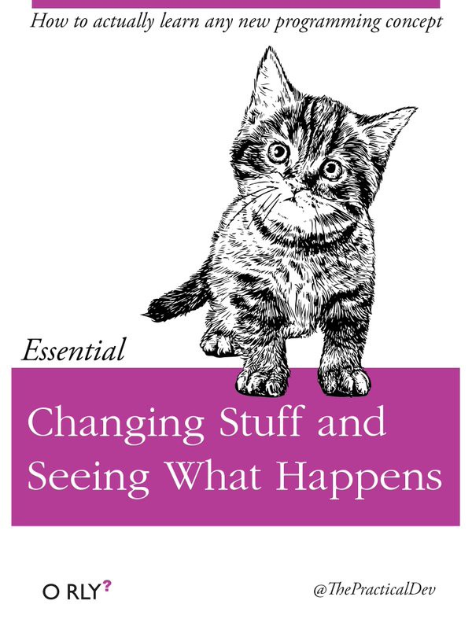
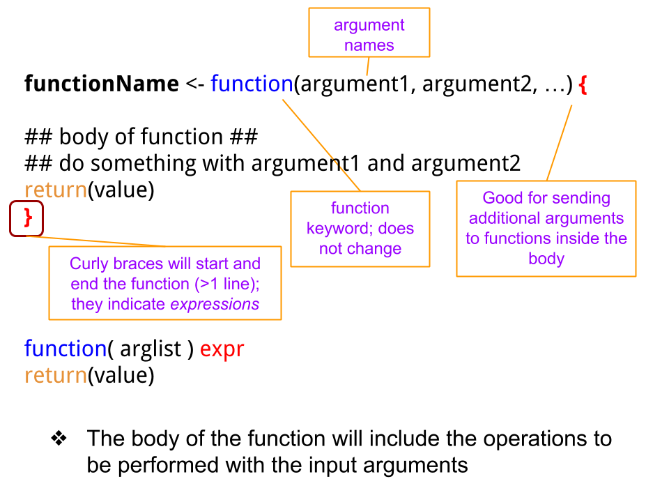
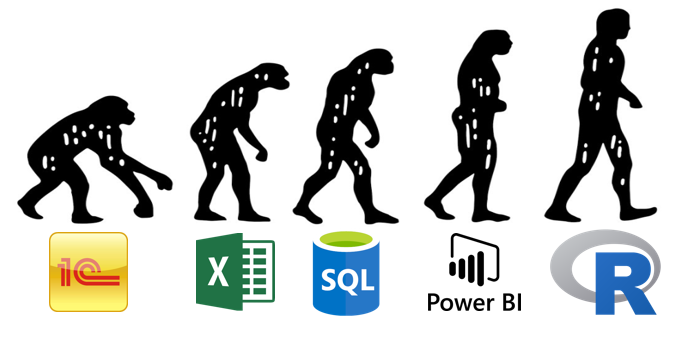
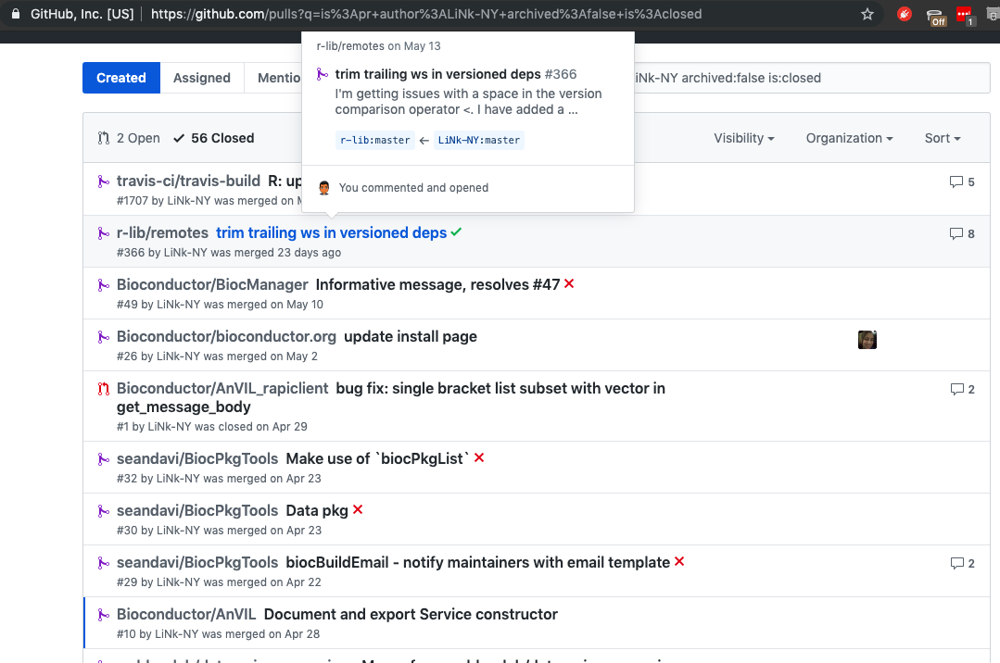

```{r setup, include = FALSE, echo = FALSE}
library(knitr)
knitr::opts_chunk$set(echo = FALSE)
```

# Announcements

* One more week to go
* Next classes
    * Data Analysis workflow
    * Reporting and reproducibility

# Topics for today

* Merging datasets
* Review for loops, plotting systems
* Functions / functionals
* Example where we use functions and loops
* Overview of summary tables and statistical tests

# Working in R



# Merging datasets

* `rbind` / `cbind` functions require equal dimensions
  * whether binding by rows or columns
  * row binding requires same column names (`colnames`)
* `merge` function allows binding between unequal dims
  * `by` argument to tell R what IDs to use
  * no sorting required
* tidyverse: `*_join` type of functions
  * `full_join`
  * auto-insertion of `NA` values

# Functions

* Extend the language
    * Portable
* Group operations for _ideally_ one purpose
* _Pure_ functions - input is the same class as the output
* Well defined inputs and output
* Save you from repeating code
* Open up the possibilities in R

# Structure of a loop

*\large{Pseudocode}*
\normalsize{}

* `for` loop structure

```{r, eval=FALSE, echo=TRUE}
for (variable in vector) {
    # < enter code here >
}
```

# Structure of a function

* `function` structure

```{r, eval = FALSE, echo=TRUE}
functionname <- function(argument1 = "default1",
                         argument2 = "default2") {
    myresult <- anotherfunction(argument1, argument2)
        return(myresult)
}
```

# More on functions



# Notes on Tuesday's lecture (cont..)

* Functions are powerful tools
* Minimize errors
* Create a set of operations to achieve a goal
* Easy to write
    * Predictable input
    * Predictable output
* Loops are useful but are not easily extensible

# Functionals

* Functional - an argument to a function that it itself is a function
* Many functions can accept other functions as an arguments
    * aggregate, tapply, lapply, sapply, apply, etc.
* Make coding more efficient and _customizeable_
* Increased flexibility but add a layer of complexity
* Why use them?
    * To simplify code and avoid repetition

# Air Pollutants Example

* R Programming on Coursera
* Write a function
* Read multiple files at once
* Compute a summary statistic

# Why don't we use Excel?

{ height=75% }

# Ranking Statistical Software



# Mini Review Session

* [\color{blue}{Zero-level R Tutorial}](http://qe4policy.ec.unipi.it/wp-content/uploads/2015/10/RTutorial-Level0.pdf)

# Common Errors and Troubleshooting

* [\color{blue}{R Basics Chapter}](https://ismayc.github.io/rbasics-book/6-errors.html)

# Data Analysis

* R is particularly good at statistics
* Packages with new methods get published faster
* Extensibility is an MAJOR advantage compared to other software

# The basics

* Frequency tables
* Calculating odds ratios
* `relevel`

# Frequencies

* `gmodels` package
* `CrossTable` function
* `table` function
    * `prop.table`

# Statistical Tests

* `chisq.test` function
    * categorical 2x2
* `fisher.test` function
    * categorical with correction for small cells
* `t.test` function
    * categorical (2 levels) & continuous

# Useful functions to apply on model objects

* Functions that work on `lm` class objects
    * `summary`
    * `fitted`
    * `resid`
    * `predict`

# Tidy model results with *broom*

* Use the `broom` package to clean up results from model functions
    * `tidy` - model coefficients
    * `augment` - fitted/residual values and more
    * `glance` - model level statistics

# Linear Regression

* `lm` function
* [\color{blue}{UCLA walk-through}](https://stats.idre.ucla.edu/r/seminars/introduction-to-regression-in-r/)

# Logistic Regression and Odds Ratios

* `glm` function
* `Odds Ratio` calculation
* [\color{blue}{UCLA tutorial}](https://stats.idre.ucla.edu/r/dae/logit-regression/)

# Community driven development



# GitHub assignment (assigned next week)

* Signup on https://github.com/
* Look for the assignment to be posted under https://github.com/CUNYSPHcode/
* Fork the repository (will contain an `.Rmd` file)
* Upload your `.Rmd` file with the answers
* Create a pull request to submit your `.Rmd` file

